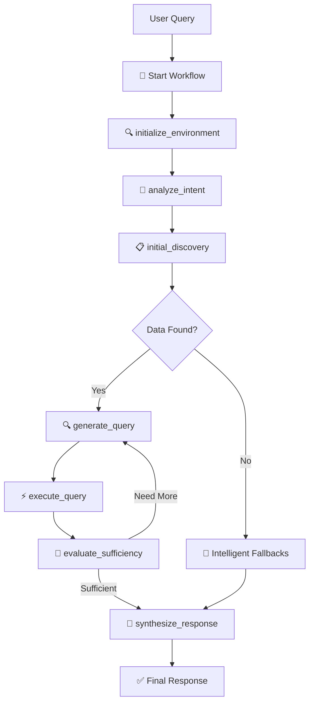
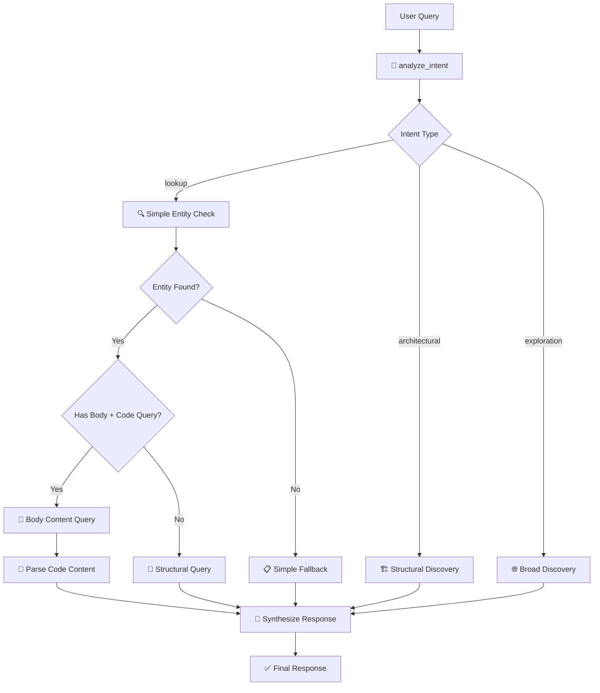

# CPG RAG Workflow Diagram

## Overview
This document maps the current Enhanced CPG RAG workflow implementation using LangGraph agents for intelligent code analysis.

## Current Workflow Architecture



## Detailed Node Breakdown

### 1. 🚀 Entry Point
- **Function**: `execute_adaptive_cpg_workflow()`
- **Purpose**: Initialize workflow state and start LangGraph execution
- **Inputs**: User query, project name, Neo4j config
- **Outputs**: Complete workflow result

### 2. 🔍 initialize_environment
- **Function**: `initialize_environment()`
- **Purpose**: Setup Neo4j connection and detect database version
- **Operations**:
  - Execute `CALL dbms.components()` to get Neo4j version
  - Load schema information
  - Set up project context
- **Key Output**: Neo4j version (5.23.0), schema data

### 3. 🎯 analyze_intent  
- **Function**: `analyze_intent()`
- **Purpose**: Understand user's query intent using LLM
- **LLM Analysis**:
  - Query Type: `lookup | architectural | exploration`
  - Scope: `specific | component | system-wide`  
  - Data Needed: `minimal | moderate | comprehensive`
- **Example Output**: `"lookup | specific | minimal"`

### 4. 📋 initial_discovery (CURRENT COMPLEX VERSION)
- **Function**: `initial_discovery()`
- **Current Implementation**:
  
  ```
  Phase 1: Disambiguation & Clarification
  ├── _disambiguate_query_terms()
  │   ├── Extract potential entities from query
  │   ├── Generate disambiguation queries per entity
  │   └── Identify entity types (Type, Function, etc.)
  │
  Phase 2: LLM-Generated Discovery Queries  
  ├── Build dynamic prompt with:
  │   ├── Intent analysis results
  │   ├── Disambiguation results
  │   ├── Complete schema information
  │   └── Dynamic strategy guidance
  ├── Generate primary_query and context_query
  └── Execute both queries
  │
  Phase 3: Intelligent Fallback System
  ├── _generate_intelligent_fallbacks()
  │   ├── Analyze all failed queries
  │   ├── Build comprehensive failure analysis
  │   ├── Generate adaptive fallback strategies
  │   └── Return list of intelligent queries
  └── Execute fallbacks until data found
  ```

### 5. 🔍 generate_query (Iterative Loop)
- **Function**: `generate_query()`
- **Purpose**: Generate next query based on current state
- **Iterations**: Up to 5 attempts
- **Uses**: Previous query results, missing information, discovered patterns

### 6. ⚡ execute_query
- **Function**: `execute_query()`
- **Purpose**: Execute the generated query via CLI
- **Process**: 
  - Calls `project-analyzer query --cypher [query] --output-format json`
  - Handles error diagnosis with `_diagnose_query_failure()`
  - Stores results in state

### 7. 🧠 evaluate_sufficiency
- **Function**: `evaluate_sufficiency()`
- **Purpose**: LLM evaluates if we have enough data to answer user query
- **Decisions**: `Need more | Sufficient`
- **Loop Control**: Determines whether to continue or synthesize

### 8. 🧠 synthesize_response
- **Function**: `synthesize_response()`
- **Purpose**: Generate final user-facing response using LLM
- **Context Management**: Smart compression of discovered data
- **Output**: Natural language response to user query

## Current Issues Identified

### ❌ Problems in Current Implementation

1. **Over-Complex Disambiguation**
   ```
   Current: Multi-step entity extraction → Dynamic queries → Complex analysis
   Problem: Often fails to identify simple entities like "WorkerA"
   ```

2. **Hardcoded Fallbacks Replaced with Over-Engineering**
   ```
   Current: Complex LLM failure analysis → Multiple adaptive strategies
   Problem: Returns dict instead of list, generates 0 fallbacks
   ```

3. **Query Generation Ignoring Results**
   ```
   Current: Generates structural queries despite disambiguation results
   Problem: Still assumes WorkerA is Function instead of Type
   ```

4. **No Body Content Usage**
   ```
   Current: Focuses on structural relationships
   Problem: Ignores 'body' properties that contain actual source code
   ```

## Proposed Simplified Workflow

### ✅ Simplified Architecture



### Key Simplifications

1. **Simple Entity Check**
   ```cypher
   MATCH (n) WHERE n.name = 'WorkerA'
   RETURN labels(n)[0] as node_type, 'body' IN keys(n) as has_body
   ```

2. **Direct Query Routing**
   ```
   IF intent=lookup AND entity_has_body AND user_wants_code_details:
       → Use body content query
   ELSE:
       → Use structural query
   ```

3. **Simple Fallbacks**
   ```
   Fallback 1: Get entity relationships
   Fallback 2: Get file contents  
   Fallback 3: Get project overview
   ```

## State Management

### Current State Structure
```python
AgentState = {
    "user_query": str,
    "project_name": str,
    "neo4j_config": str,
    "neo4j_version": str,
    "schema": Dict,
    
    # Intent Analysis
    "intent_analysis": {
        "query_type": "lookup|architectural|exploration",
        "scope": "specific|component|system-wide",
        "data_needed": "minimal|moderate|comprehensive"
    },
    
    # Discovery Results  
    "discovered_data": List[Dict],
    "query_history": List[Dict],
    "all_executed_queries": List[Dict],
    "raw_query_results": List[Dict],
    
    # Disambiguation (Current Complex)
    "disambiguation_status": str,
    "entities_found": Dict,
    
    # Workflow Control
    "current_iteration": int,
    "max_iterations": int,
    "should_continue": bool,
    "current_node": str
}
```

## Entry Points

### 1. MCP Tool Integration
- **File**: `/opt/genpod/src/project_analyzer_tool/tools.py`
- **Function**: `query_cpg_rag()`
- **Purpose**: MCP tool that calls the LangGraph workflow

### 2. Direct Workflow Execution  
- **File**: `/opt/genpod/src/core/adaptive_cpg_agent_workflow.py`
- **Function**: `execute_adaptive_cpg_workflow()`
- **Purpose**: Direct workflow execution for testing

## Example Flow Analysis

### User Query: "What variable name stores the formatted message in WorkerA?"

#### Current Complex Flow:
```
1. Intent: lookup | specific | minimal ✅
2. Disambiguation: Failed to identify "WorkerA" ❌
3. Query Generation: Assumes WorkerA is Function ❌
4. Fallback Generation: Returns dict instead of list ❌
5. Result: Generic architectural response ❌
```

#### Proposed Simplified Flow:
```
1. Intent: lookup | specific | minimal ✅
2. Entity Check: WorkerA → Type with body=true ✅
3. Route: Code details + has body → body content query ✅
4. Execute: Get WorkerA source code ✅
5. Parse: Extract variable names from code ✅
6. Response: "The variable is 'formattedMessage'" ✅
```

## Performance Characteristics

### Current Implementation
- **Nodes Executed**: 7+ workflow nodes
- **LLM Calls**: 8-12 calls per query
- **Query Execution**: 3-6 Neo4j queries
- **Success Rate**: Low for specific lookups
- **Response Quality**: Generic architectural analysis

### Proposed Implementation  
- **Nodes Executed**: 3-4 workflow nodes
- **LLM Calls**: 2-4 calls per query
- **Query Execution**: 1-2 Neo4j queries
- **Success Rate**: High for direct questions
- **Response Quality**: Specific, actionable answers

## Next Steps

1. **Simplify initial_discovery()** to use direct entity checking
2. **Implement body content parsing** for code-level queries  
3. **Remove over-engineered disambiguation** and fallback systems
4. **Add simple query routing** based on intent + entity type
5. **Test with the WorkerA variable query** to validate improvements
