# File Watcher Service: Resilient Design Architecture

## Overview

The file watcher service needs to monitor projects continuously, even when the MCP server restarts. This document outlines the current issues and proposes a resilient architecture design.

## Current Architecture Problems

### ❌ **Current Issues**
1. **Project configuration lost on MCP server restart** - stored only in memory
2. **File watcher stops monitoring** when MCP server goes down
3. **No recovery mechanism** - manual reconfiguration required
4. **Split storage** - checksums in Redis, config in memory
5. **Tight coupling** - file watcher dependent on MCP server for config

## Proposed Solution: File-Based Persistent Configuration

### 🚨 **Key Insight**: Keep MCP Server Simple
**Problem with Redis approach**: Adding Redis dependency to MCP server creates unnecessary complexity.

**Better approach**: Use file-based configuration that both components can read/write independently.

### 🎯 **Design Goals**
- **Persistent monitoring** across service restarts
- **Independent operation** of file watcher
- **No additional dependencies** for MCP server
- **File-based configuration** that both components can access
- **Graceful degradation** when components are down

---

## Architecture Flow Diagram

```mermaid
graph TB
    subgraph "User Actions"
        U1[User runs full_project_setup]
        U2[User runs analyze_project_only]
        U3[User runs vectorize_codebase_only]
    end

    subgraph "MCP Server Process"
        MCP[MCP Server]
        T1[full_project_setup tool]
        T2[analyze_project_only tool]
        T3[vectorize_codebase_only tool]
        T4[process_file_changes tool]
        HTTP[HTTP /project-config endpoint]
    end

    subgraph "Shared File System"
        PC[project_config.json]
        MS[monitoring_state.json]
        CQ[change_queue.json]
    end

    subgraph "File Watcher (Redis)"
        FW[File Watcher Service]
        FSO[File System Observer]
        MCM[MCP Connection Manager]
        CHK[Checksum Manager - Redis]
    end

    subgraph "External Systems"
        FS[File System]
        VDB[Vector Database]
        NEO[Neo4j Database]
    end

    %% User Actions
    U1 --> T1
    U2 --> T2  
    U3 --> T3

    %% MCP Tools write to shared files
    T1 -->|Write config| PC
    T1 -->|Enable monitoring| MS
    T2 -->|Write config| PC
    T2 -->|Enable monitoring| MS
    T3 -->|Write config| PC
    T3 -->|Enable monitoring| MS

    %% MCP Server serves config via HTTP (backward compatibility)
    PC -->|Read| HTTP
    MS -->|Read| HTTP

    %% File Watcher reads from shared files
    FW -->|Watch config file| PC
    FW -->|Read monitoring state| MS
    FW -->|Process change queue| CQ
    FW -->|Use Redis for checksums| CHK

    %% File System Monitoring
    FS -->|File changes| FSO
    FSO -->|File events| CHK
    CHK -->|Compare checksums| CHK
    CHK -->|Queue changes| CQ

    %% MCP Communication (when available)
    FW -->|Connect| MCM
    MCM -->|Call process_file_changes| T4
    T4 -->|Trigger reanalysis| VDB
    T4 -->|Trigger reanalysis| NEO

    %% Recovery Flows
    MCP -.->|Startup recovery| PC
    MCP -.->|Restore state| MS
    FW -.->|Startup discovery| PC
    FW -.->|Resume monitoring| MS

    %% Styling
    classDef userAction fill:#e1f5fe
    classDef mcpServer fill:#f3e5f5
    classDef sharedFiles fill:#fff3e0
    classDef fileWatcher fill:#e8f5e8
    classDef external fill:#fce4ec

    class U1,U2,U3 userAction
    class MCP,T1,T2,T3,T4,HTTP mcpServer
    class PC,MS,CQ sharedFiles
    class FW,FSO,MCM,CHK fileWatcher
    class FS,VDB,NEO external
```



---

## Data Storage Schema

### 📁 **File-Based Configuration**

#### **`/opt/genpod/project_config.json`** - Main Project Configuration
```json
{
  "project_id": "HelloWorldApp",
  "project_path": "/opt/HelloWorldApp",
  "collection_name": "helloworld-comprehensive",
  "monitoring_enabled": true,
  "monitoring_mode": "comprehensive",
  "analysis_status": {
    "vectorization": {
      "completed": true,
      "timestamp": "2025-07-07T18:17:30Z",
      "collection": "helloworld-comprehensive"
    },
    "cpg_analysis": {
      "completed": true,
      "timestamp": "2025-07-07T18:18:45Z",
      "nodes_created": 1247,
      "relationships_created": 3891
    }
  },
  "supported_extensions": [".py", ".js", ".cs", ".java", ".cpp"],
  "ignore_dirs": ["node_modules", ".git", "bin", "obj", ".env"],
  "created_at": "2025-07-07T18:17:30Z",
  "last_updated": "2025-07-07T18:18:45Z"
}
```

#### **`/opt/genpod/monitoring_state.json`** - File Watcher State
```json
{
  "active": true,
  "watcher_pid": 12345,
  "last_heartbeat": "2025-07-07T19:30:00Z",
  "mcp_server_connected": true,
  "pending_changes_count": 0,
  "total_files_monitored": 156,
  "redis_checksum_key": "checksums:HelloWorldApp"
}
```

#### **`/opt/genpod/change_queue.json`** - Pending File Changes
```json
{
  "queue": [
    {
      "files": ["src/main.py", "src/utils.py"],
      "timestamp": "2025-07-07T19:30:00Z",
      "change_type": "modified",
      "processed": false,
      "retry_count": 0
    }
  ],
  "last_processed": "2025-07-07T19:29:00Z"
}
```

#### **Redis (File Watcher Only)** - File Checksums
```json
{
  "checksums:HelloWorldApp": {
    "src/main.py": {
      "checksum": "a1b2c3d4e5f6",
      "last_modified": "2025-07-07T19:25:00Z",
      "git_commit": "abc123def456",
      "size": 2048
    },
    "src/utils.py": {
      "checksum": "f6e5d4c3b2a1", 
      "last_modified": "2025-07-07T19:28:00Z",
      "git_commit": "def456abc123",
      "size": 1024
    }
  }
}
```

---

## Component Flows

### 🔄 **1. Project Setup Flow**

```
User Action → MCP Tool → Analysis → Redis Update → File Watcher Activation

┌─────────────────┐    ┌──────────────────┐    ┌─────────────────┐
│ User runs       │    │ MCP Server       │    │ Redis Store     │
│ full_project_   │───▶│ 1. Vectorization │───▶│ Store project   │
│ setup           │    │ 2. CPG Analysis  │    │ configuration   │
└─────────────────┘    │ 3. Enable Monitor│    │ Enable monitor  │
                       └──────────────────┘    └─────────────────┘
                                │                        │
                                ▼                        ▼
                       ┌──────────────────┐    ┌─────────────────┐
                       │ File Watcher     │◀───│ Discovers new   │
                       │ Starts Monitor   │    │ project config  │
                       └──────────────────┘    └─────────────────┘
```

### 🔄 **2. File Change Detection Flow**

```
File Change → Checksum Check → Queue Change → MCP Notification → Reanalysis

┌─────────────────┐    ┌──────────────────┐    ┌─────────────────┐
│ Developer       │    │ File System      │    │ File Watcher    │
│ edits file      │───▶│ Change event     │───▶│ Capture event   │
└─────────────────┘    └──────────────────┘    │ Check checksum  │
                                               │ Store in Redis  │
                                               └─────────────────┘
                                                        │
                       ┌─────────────────┐    ┌──────────────────┐
                       │ Reanalysis      │◀───│ MCP Server       │
                       │ - Update Vector │    │ Process changes  │
                       │ - Update CPG    │    │ Call tools       │
                       └─────────────────┘    └──────────────────┘
```

### 🔄 **3. Service Recovery Flow**

```
Service Restart → Redis Recovery → Resume Monitoring

┌─────────────────┐    ┌──────────────────┐    ┌─────────────────┐
│ MCP Server      │    │ Redis Recovery   │    │ File Watcher    │
│ Restarts        │───▶│ Read project     │───▶│ Resumes         │
│                 │    │ configurations   │    │ monitoring      │
└─────────────────┘    │ Restore state    │    │ automatically   │
                       └──────────────────┘    └─────────────────┘
                                │
                                ▼
                       ┌──────────────────┐
                       │ Queue Processing │
                       │ Process pending  │
                       │ file changes     │
                       └──────────────────┘
```

---

## Implementation Steps

### ✅ **Phase 1: File-Based Configuration**

1. **Add file-based project configuration storage** to MCP tools
   ```python
   # After successful analysis in full_project_setup()
   config_file = "/opt/genpod/project_config.json"
   project_config = {
       "project_path": project_path,
       "monitoring_enabled": True,
       "analysis_status": {"vectorization": True, "cpg": True},
       "last_updated": datetime.now().isoformat()
   }
   with open(config_file, 'w') as f:
       json.dump(project_config, f, indent=2)
   ```

2. **Modify file watcher startup** to read from file first
   ```python
   # Priority 1: File-based configuration
   config_file = "/opt/genpod/project_config.json"
   if os.path.exists(config_file):
       with open(config_file, 'r') as f:
           config = json.load(f)
       if config.get("monitoring_enabled"):
           await start_monitoring(config)
   ```

### ✅ **Phase 2: State Recovery**

3. **Add MCP server startup recovery**
   ```python
   @app.on_event("startup")
   async def restore_state():
       config_file = "/opt/genpod/project_config.json"
       if os.path.exists(config_file):
           with open(config_file, 'r') as f:
               project_config = json.load(f)
           if project_config.get("monitoring_enabled"):
               _project_config.update(project_config)
   ```

4. **Implement heartbeat mechanism**
   ```python
   # File watcher updates monitoring state file
   state_file = "/opt/genpod/monitoring_state.json"
   state = {
       "last_heartbeat": datetime.now().isoformat(),
       "active": True,
       "watcher_pid": os.getpid()
   }
   with open(state_file, 'w') as f:
       json.dump(state, f, indent=2)
   ```

### ✅ **Phase 3: Resilient Communication**

5. **Add change queuing for offline scenarios**
   ```python
   # Queue changes when MCP server is unavailable
   queue_file = "/opt/genpod/change_queue.json"
   if not mcp_connection.is_connected():
       # Append to change queue file
       with open(queue_file, 'r+') as f:
           queue_data = json.load(f)
           queue_data["queue"].append({
               "files": changed_files,
               "timestamp": datetime.now().isoformat(),
               "processed": False
           })
           f.seek(0)
           json.dump(queue_data, f, indent=2)
   else:
       await mcp_client.process_file_changes(changed_files)
   ```

6. **Implement queue processing on reconnection**
   ```python
   # Process queued changes when MCP server comes back online
   queue_file = "/opt/genpod/change_queue.json"
   with open(queue_file, 'r') as f:
       queue_data = json.load(f)
   
   for change_batch in queue_data["queue"]:
       if not change_batch["processed"]:
           await mcp_client.process_file_changes(change_batch["files"])
           change_batch["processed"] = True
   
   # Update queue file
   with open(queue_file, 'w') as f:
       json.dump(queue_data, f, indent=2)
   ```

---

## Benefits of This Design

### 🎯 **Resilience Benefits**
- ✅ **Persistent monitoring** - Continues across all service restarts
- ✅ **Automatic recovery** - Both components restore state independently  
- ✅ **No manual intervention** - Projects resume monitoring automatically
- ✅ **Graceful degradation** - File changes queued when MCP server is down
- ✅ **No additional dependencies** - MCP server stays simple

### 🚀 **Operational Benefits**
- ✅ **Independent operation** - File watcher works without MCP server
- ✅ **Simple deployment** - No Redis dependency for MCP server
- ✅ **Development flexibility** - Easy to restart services during development
- ✅ **Production stability** - System resilient to individual component failures
- ✅ **Multi-project support** - Different config files for different projects

### 🔧 **Technical Benefits**
- ✅ **Hybrid storage** - Files for config, Redis for checksums only
- ✅ **Clean separation** - Clear boundaries between components
- ✅ **Extensible** - Easy to add new monitoring features
- ✅ **Observable** - JSON files provide human-readable state visibility
- ✅ **Backward compatible** - HTTP endpoint still works for existing clients

---

## Migration Strategy

### 📋 **Step-by-Step Migration**

1. **Week 1**: Implement Redis project configuration storage
2. **Week 2**: Modify file watcher to use Redis as primary source
3. **Week 3**: Add MCP server state recovery mechanism
4. **Week 4**: Implement change queuing and offline resilience
5. **Week 5**: Testing and validation with multiple restart scenarios

### 🧪 **Testing Approach**

1. **Test project setup** → Verify Redis storage
2. **Test MCP server restart** → Verify state recovery
3. **Test file watcher restart** → Verify monitoring resumes
4. **Test offline scenarios** → Verify change queuing
5. **Test multiple projects** → Verify isolation

This design ensures that once a project is analyzed, the file watcher will persistently monitor it across any service restarts, providing a truly resilient development experience.