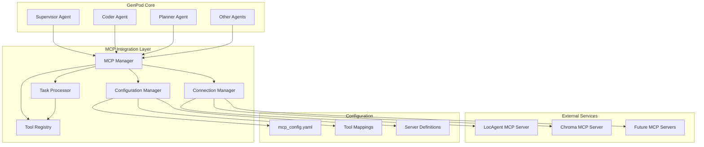

# 🏛️ UML Component Diagram

```mermaid
graph TB
    subgraph "GenPod Core"
        A[Supervisor Agent]
        B[Coder Agent]
        C[Planner Agent]
        D[Other Agents]
    end
    
    subgraph "MCP Integration Layer"
        E[MCP Manager]
        F[Configuration Manager]
        G[Task Processor]
        H[Connection Manager]
        I[Tool Registry]
    end
    
    subgraph "External Services"
        J[LocAgent MCP Server]
        K[Chroma MCP Server]
        L[Future MCP Servers]
    end
    
    subgraph "Configuration"
        M[mcp_config.yaml]
        N[Tool Mappings]
        O[Server Definitions]
    end
    
    A --> E
    B --> E
    C --> E
    D --> E
    
    E --> F
    E --> G
    E --> H
    E --> I
    
    F --> M
    F --> N
    F --> O
    
    H --> J
    H --> K
    H --> L
    
    G --> I
```
